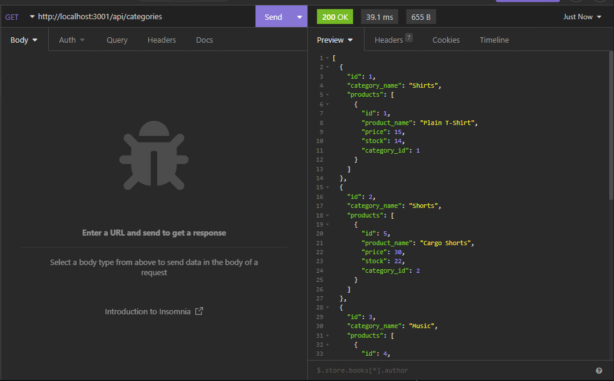
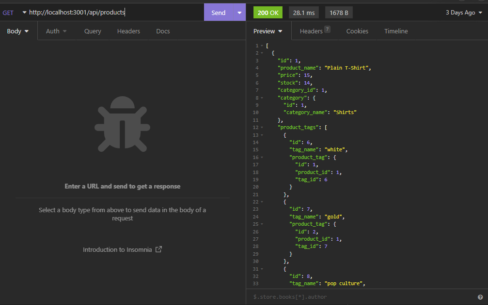
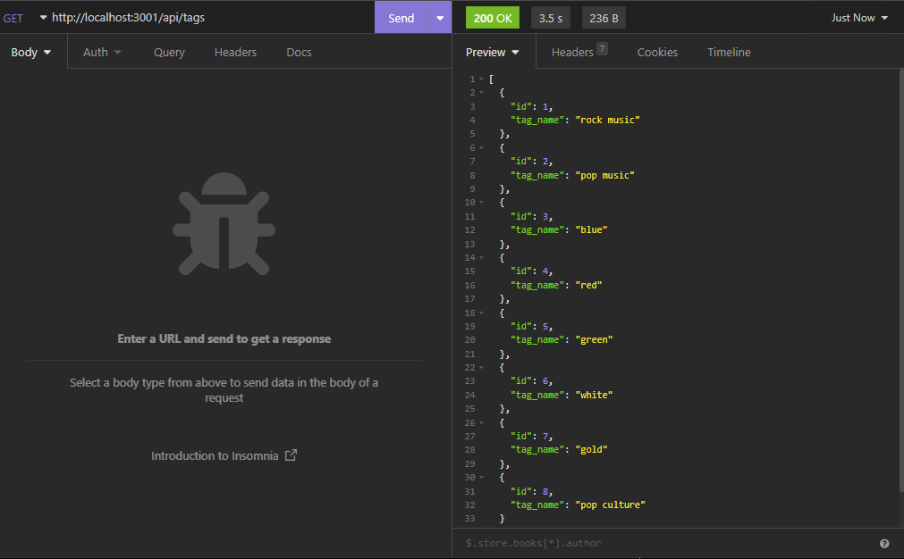

# E-Commerce-ORM Back End

## About the Project
This application was created to be a back end for an E-Commerce website using Object Relational Mapping. Using the application the user can get a list of all the products, categories, and product tags in their database. The user can create a product, category, and tags for the products. When creating a product you are able to set the price, the amount of stock on hand, the category the product belongs to, and the tags associated with the product. Users can also easily delete and update products, categories, and product tags without the need for dropping the database and recreating everything one by one.

## Built With:

## Tested Using:

## Installation Requirements
This application is dependant on Node.js, Express.js, Sequelize, dotenv, and MySQL2. Make sure to also add a .env file to hold your MySQL username and password so that private information is kept secure.

## Walkthrough Video
https://drive.google.com/file/d/19PHDZXyKbnEQiZ-Hh-qY73LHNs6VsoE5/view

## Here's a preview of what the application looks like when testing with Insomnia
#### GET all categories

#### GET all products

#### GET all product-tags

## Contribution:
Made by Mitchell Armstrong

## Contact
Mitchell Armstrong - mra0211@gmail.com
